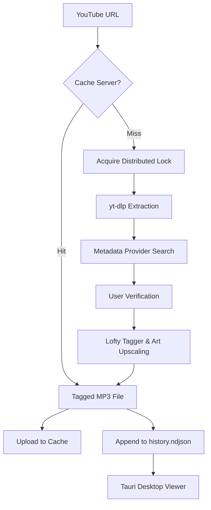

# EchoTag

EchoTag is a multi-platform tool for downloading and managing music. Standard YouTube downloaders often leave files with generic names, missing tags, and low-quality or absent cover art. EchoTag solves this by extracting audio and automatically embedding official metadata from official music platforms, ensuring your local music library remains clean and organized.

Beyond downloading, EchoTag provides an AI-driven recommendation engine, a distributed caching server to eliminate duplicate network downloads, and a native desktop viewer for listening history.

## Requirements

Ensure the following dependencies are installed and available in your system `PATH`:

- **Rust** (stable toolchain)
- **`yt-dlp`**: For audio extraction.
- **`ffmpeg`**: Required by `yt-dlp` for audio conversion and metadata embedding.

Additionally, the following files must be present in the workspace root directory:

- **`cookies.txt`**: You must provide a YouTube cookies file in the root directory to bypass download restrictions. You can generate this using a browser extension like [Get cookies.txt LOCALLY](https://chromewebstore.google.com/detail/cclelndahbckbenkjhflpdbgdldlbecc?utm_source=item-share-cb).
- **`default_cover_art.jpg`**: A fallback image used when remote cover art cannot be fetched. _Note: If this file is missing, the application will panic during the tagging process._

## Configuration

EchoTag relies on a `.env` file in the workspace root. You can generate it interactively:

```bash
# Configure AI provider (OpenAI, Gemini, Anthropic, or Ollama)
cargo run -p cli -- config --setup-model

# Configure the distributed cache server IP
cargo run -p cli -- config --setup-cache-server
```

### Proxy Configuration

To use the proxy module, configure your proxy source list in the designated configuration file. The module will concurrently test the sourced proxies against YouTube and filter out dead or slow connections before passing the valid ones to `yt-dlp`.

## Usage

All commands must be executed from the workspace root to ensure the application can locate `cookies.txt`, `default_cover_art.jpg`, and `history.ndjson`. If `history.ndjson` does not exist, the CLI will create it automatically after your first successful download.

### Downloading and Tagging

Pass one or more YouTube URLs to the `download` command:

```bash
cargo run -p cli -- download -c cookies.txt <URL> [<URL>...]
```

**Workflow:**

1. **Cache Check**: Extracts the video ID and queries the cache server. If available, it streams the tagged MP3 and metadata directly.
2. **Lock Acquisition**: If uncached, it attempts to claim the video ID on the server. This prevents duplicate processing if multiple users request the same track simultaneously. If claimed by another user, the CLI polls until the cache is ready (up to 1 minute).
3. **Extraction**: Downloads and converts the audio via `yt-dlp`.
4. **Resolution**: Queries the metadata provider. You are prompted to verify, search again, or manually input the correct tags.
5. **Embedding**: Writes the metadata and high-resolution cover art to the file using `lofty`.
6. **Distribution**: Renames the file to `Artist - Track - (Album).mp3`, uploads it to the cache server, and appends the record to `history.ndjson`.

### Desktop Viewer

Launch the Tauri desktop app to view your listening history:

```bash
cargo run -p desktop
```

The Rust backend reads `history.ndjson` asynchronously line-by-line and exposes it to the frontend via a Tauri IPC command (`get_history`). To optimize display and support offline files, the backend processes artwork URLs before sending them to the frontend:

**Artwork Handling:**

- **Local Fallback**: Checks the active directory for custom local files matching the `<artist_name>_<track_name>.jpg` pattern. If found, it encodes the file as a Base64 Data URI.
- **Default Artwork**: If the URL is `default_cover_art.jpg`, it reads the local file from disk and encodes it as a Base64 Data URI.
- **Remote Upscaling**: If it's a remote iTunes URL, it upgrades the dimensions in the URL from 100x100 to 2000x2000.
- **Frontend Fallback**: If a remote image fails to load, the Vanilla JS frontend intercepts the `onerror` event and swaps the source with an inline, URL-encoded SVG music note.

### AI Chat

Start an interactive chat session. The AI reads your `history.ndjson` to build a context window (your top 15 most listened to artists and last 10 downloaded tracks). Based on this, it provides 3 music recommendations. The AI agent is equipped with tools to autonomously search YouTube and trigger the download workflow based on your conversation and is strictly instructed to copy exact URLs from search results to prevent hallucination errors.

```bash
cargo run -p cli -- chat
```

## Architecture & Data Flow



### The Metadata Pipeline

1. **Extraction**: `yt-dlp` extracts the audio stream and initial title/channel information.
2. **Resolution**: The CLI passes the channel and title to a `MetadataProvider` (defaults to iTunes). The provider searches the official API, progressively truncating the query if no results are found, and returns a standardized `Metadata` struct.
3. **Verification**: The CLI prompts the user to accept, re-search, or manually override the proposed tags.
4. **Embedding**: The `tagger` uses `lofty` to write ID3v2 tags and embeds high-res cover art (automatically upscaling iTunes URLs from 100x100 to 2000x2000).
5. **Persistence**: The final `Metadata` struct is serialized and appended to `history.ndjson`.
6. **Visualization**: The Tauri desktop app asynchronously reads the NDJSON file, resolves local/remote artwork, and renders the UI.

## Features

- **Automated Tagging**: Extracts audio and embeds official metadata (artist, track, album, genre) and cover art. Remote artwork URLs are automatically upscaled before embedding.
- **Extensible Providers**: Defaults to fetching metadata from iTunes, but supports any official music platform. You can implement the `MetadataProvider` trait for your preferred platform and integrate it into the workflow.
- **Progressive Metadata Search**: The default iTunes provider uses a fallback search algorithm, progressively truncating query terms to ensure a match is found even if the initial YouTube title is messy.
- **AI Chat Agent**: An interactive CLI chat that analyzes your listening history to recommend music and autonomously searches and downloads tracks via a chat interface powered by OpenAI, Gemini, Anthropic, or Ollama.
- **Distributed Cache Server**: A standalone Axum server that caches tagged MP3s and metadata. It uses a claim/lock mechanism to prevent race conditions when multiple clients request the same uncached video simultaneously.
- **Native Desktop Viewer**: A lightweight Tauri app that reads local history asynchronously. It handles artwork gracefully by encoding local files to Base64, upscaling remote URLs, and falling back to an inline SVG placeholder on network failures.
- **Proxy Sourcing**: A dedicated module to fetch, test, and filter HTTP/SOCKS proxies from user-defined sources, ensuring reliable downloads in restricted network environments.

## Repository Layout

```text
EchoTag/
├── cli/
│   ├── src/
│   │   ├── bin/
│   │   │   └── cache_server.rs # Standalone Axum web server
│   │   ├── main.rs               # Entry point, CLI parsing, download orchestration
│   │   ├── youtube.rs            # yt-dlp wrapper, progress parsing, search
│   │   ├── itunes.rs             # Default MetadataProvider implementation
│   │   ├── metadata_provider.rs  # Trait definition and progressive search fallback
│   │   ├── tagger.rs             # Audio file renaming and metadata embedding
│   │   ├── cache_client.rs       # HTTP client for the distributed cache server
│   │   ├── history.rs            # NDJSON history management and AI prompt generation
│   │   ├── ai.rs                 # AI agent setup and chat loop (rig)
│   │   └── proxy.rs              # Proxy fetcher and tester
├── desktop/
│   ├── src-tauri/src/lib.rs      # Tauri commands, NDJSON reading, artwork Base64 encoding
│   └── src/                 # Vanilla JS UI
└── shared/
    └── src/models.rs             # Shared data structs (Metadata, AudioDownload, etc.)
```

## Cache Server

The cache server allows you to share downloaded and tagged music across a network. This is particularly useful if you want to run a Telegram bot on a VPS that downloads and tags music, or if you want to share a cache with friends to avoid downloading duplicate tracks.

**Storage & Cleanup**
It uses a local SQLite database (`cache.db`) to track states (`pending`, `ready`) and stores files in `./cache/{video_id}/`. A background Tokio task routinely cleans up stale locks (entries stuck in `pending` for >10 minutes) to prevent deadlocks from interrupted downloads.

**Running the Server**

Via Cargo:

```bash
cargo run -p EchoTag --bin cache_server
```

Via Docker:

```bash
docker build -t echotag-cache-server -f Dockerfile .
docker run -d -p 3000:3000 echotag-cache-server
```

**API Endpoints**
The server binds to `0.0.0.0:3000`:

- `GET /health`: Returns a simple connection string to verify the server is running.
- `POST /cache/{id}/claim`: Attempts to insert a video ID into the database with a `pending` status. Returns 200 OK if successful, or 409 Conflict if another user has already claimed the ID.
- `POST /cache/{id}/upload`: Accepts multipart form data containing the MP3 file (`file` field) and a JSON string of the `Metadata` struct (`metadata` field). Saves the files to disk and updates the database entry to `ready`.
- `GET /cache/{id}`: Streams the cached MP3 file to the client.
- `GET /cache/{id}/metadata`: Returns the JSON metadata associated with the cached video ID.
